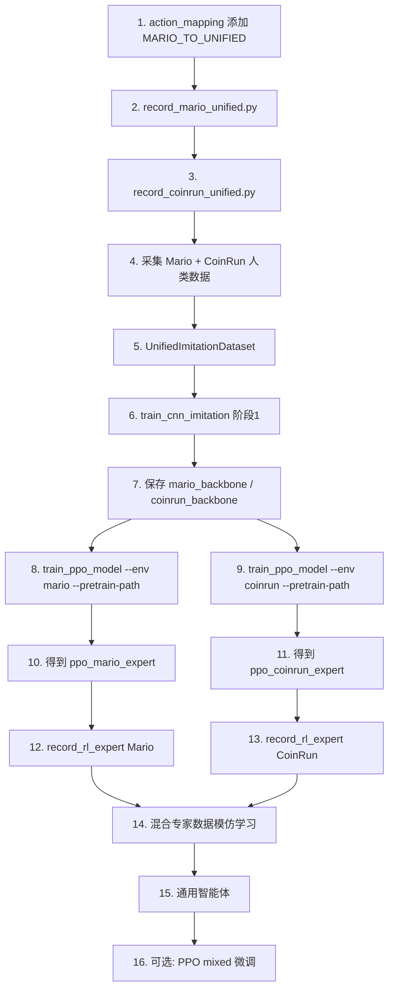

# 通用智能体四阶段训练计划

> 目标：训练一个可同时玩 Mario 1-1 和 CoinRun 的通用智能体（毕业设计）

---

## 核心逻辑

- **专家 = 第二步的 RL 模型**：人类数据仅用于 bootstrap，RL 训练后的模型表现更好，视为「专家」
- **两个游戏专用模型**：第二步分别训练 Mario 专用、CoinRun 专用两个 RL 模型
- **专家数据更优**：第二步获得的数据质量高于人类演示
- **混合数据在最后**：用两个 RL 专家的轨迹混合训练，得到**一个**通用智能体

---

## 流程概览

```
┌─────────────────────────────────────────────────────────────────┐
│ 阶段 1：人类数据 + 模仿学习（bootstrap）                             │
│ 人类玩 Mario + 人类玩 CoinRun → 分别模仿学习 → 两个游戏专用 CNN       │
│ 输出：mario_backbone.pt、coinrun_backbone.pt（供 RL 初始化）         │
└─────────────────────────────────────────────────────────────────┘
                              ↓
┌─────────────────────────────────────────────────────────────────┐
│ 阶段 2：分别 RL 训练 → 两个 RL 专家                                 │
│ Mario backbone → PPO(Mario) → Mario 专家模型                       │
│ CoinRun backbone → PPO(CoinRun) → CoinRun 专家模型                 │
│ 输出：ppo_mario_expert.zip、ppo_coinrun_expert.zip（专家）          │
└─────────────────────────────────────────────────────────────────┘
                              ↓
┌─────────────────────────────────────────────────────────────────┐
│ 阶段 3：RL 专家数据采集                                            │
│ Mario 专家在 Mario 上游玩 → 收集 state-action 对                     │
│ CoinRun 专家在 CoinRun 上游玩 → 收集 state-action 对                │
│ 输出：data_imitation_unified/rl_expert_mario/、rl_expert_coinrun/   │
└─────────────────────────────────────────────────────────────────┘
                              ↓
┌─────────────────────────────────────────────────────────────────┐
│ 阶段 4：混合专家数据 → 训练通用智能体                                │
│ 混合 rl_expert_mario + rl_expert_coinrun → 模仿学习 → 一个 CNN      │
│ 可选：再用 PPO 在 mixed 模式上微调                                   │
│ 输出：通用智能体（同一套参数，可玩两个游戏）                          │
└─────────────────────────────────────────────────────────────────┘
```

---

## 一、阶段 1：人类数据 + 模仿学习（bootstrap）

### 1.1 目标

- 人类分别玩 Mario 和 CoinRun，采集 state-action 对
- **分别**训练两个 CNN（Mario 专用、CoinRun 专用），或混合训练一个作为通用 backbone
- 输出：供阶段 2 RL 初始化的 backbone

### 1.2 数据格式约定

| 项目 | 要求 | 说明 |
|------|------|------|
| 观测 | 84×84 灰度，4 帧堆叠 | 与 `VecFrameStack` + `channels_order="last"` 一致 |
| 动作标签 | 0–14（15 维统一动作） | 与 `ActionMappingWrapper.UNIFIED_ACTION_DIM` 一致 |
| 存储格式 | 每样本 1 个目录：`frame_0.png` ~ `frame_3.png` + `label.txt` | `label.txt` 内容为 0–14 的整数 |

### 1.2.1 数据采集量标准（阶段 1）

| 数据来源 | 最低样本数 | 推荐样本数 | 参考 |
|----------|------------|------------|------|
| `mario/` | 3,000 | 5,000–10,000 | Mario 1-1 约 40–70 局（每局 150–250 样本） |
| `coinrun/` | 3,000 | 5,000–10,000 | CoinRun 固定关卡下约 40–70 局（每局 150–250 样本） |

- **最低**：用于流程验证，确保模仿学习能跑通、验证集准确率 > 随机 (6.7%)
- **推荐**：用于正式训练，bootstrap 效果更稳定
- **动作分布**：尽量覆盖 15 个动作，避免某几类样本过少

### 1.3 目录结构

```
data_imitation_unified/
├── mario/                 # 阶段 1：人类 Mario 数据
│   └── 000001/
│       ├── frame_0.png ~ frame_3.png
│       └── label.txt
├── coinrun/               # 阶段 1：人类 CoinRun 数据
│   └── 000001/
│       └── ...
├── rl_expert_mario/       # 阶段 3：Mario RL 专家数据
│   └── 000001/
│       └── ...
├── rl_expert_coinrun/     # 阶段 3：CoinRun RL 专家数据
│   └── 000001/
│       └── ...
└── meta.json              # 可选：样本数、来源分布
```

### 1.4 实施任务

| 序号 | 任务 | 文件 | 状态 |
|------|------|------|------|
| 1.1 | 添加 `MARIO_TO_UNIFIED` 反向映射 | `envs/action_mapping.py` | 已实现 |
| 1.2 | Mario 统一格式采集脚本 | `playing/record_mario_unified.py` | 已实现（建议后续补续写编号，避免覆盖） |
| 1.3 | CoinRun 统一格式采集脚本 | `playing/record_coinrun_unified.py` | 已实现 |
| 1.4 | 统一数据集类 | `dataset/unified_imitation_dataset.py` | 已实现 |
| 1.5 | 模仿学习训练脚本（可分游戏或混合） | `train_model/train_cnn_imitation_unified.py` | 已实现（当前 `human_both`=人类 mario+coinrun） |
| 1.6 | 保存 backbone 供阶段 2 PPO 加载 | 输出 `mario_backbone.pt`、`coinrun_backbone.pt` 或统一 `imitation_backbone.pt` | 已实现 |

### 1.5 关键实现要点

**record_mario_unified.py**：
- 使用 `make_mario_env()`（COMPLEX_MOVEMENT + 84×84 灰度 + SkipFrame）
- 维护 4 帧滑动窗口，每步保存最近 4 帧 + 当前动作
- Mario 原生动作 (0–11) → `MARIO_TO_UNIFIED` → 统一动作 (0–14)

**record_coinrun_unified.py**：
- 复用 Procgen 的观测预处理、键盘映射与 4 帧堆叠采样口径
- 作为当前毕业设计主线中的第二环境，和 Mario 一起组成 `human_both`

**UnifiedImitationDataset**：
- 扫描 `data_imitation_unified/` 下各子目录（mario、coinrun、rl_expert_mario、rl_expert_coinrun）
- 每样本：4 张 PNG 堆叠为 (84, 84, 4)，`label.txt` → 0–14
- 支持 `include_sources=["mario", "coinrun", "rl_expert_mario", "rl_expert_coinrun"]` 过滤

**train_cnn_imitation_unified.py**：
- CNN backbone 与 `CustomCNN` 结构一致（Conv + Linear → 512 维）
- 分类头：`Linear(512, 15)`
- 可分游戏训练输出 `mario_backbone.pt`、`coinrun_backbone.pt`，或混合训练输出统一 backbone

### 1.6 验证检查点

- [ ] `UnifiedImitationDataset` 能正确加载，`len(dataset) > 0`
- [ ] `obs.shape == (84, 84, 4)`，`label in range(15)`
- [ ] 训练跑通，验证集准确率 > 随机 (1/15 ≈ 6.7%)

---

## 二、阶段 2：分别 RL 训练 → 两个 RL 专家

### 2.1 目标

- 用阶段 1 的 backbone 初始化 PPO
- **分别**在 Mario 和 CoinRun 上训练，得到**两个**游戏专用 RL 模型
- 这两个 RL 模型即为「专家」（比人类数据质量更高）

### 2.2 实施任务

| 序号 | 任务 | 文件 | 状态 |
|------|------|------|------|
| 2.1 | PPO 支持 `--pretrain-path` | `train_model/train_ppo_model.py` | 已实现 |
| 2.2 | 分别训练 Mario 专家、CoinRun 专家 | 同上，`--env mario` / `--env coinrun` 各跑一次 | 已实现（待实际训练产出专家模型） |
| 2.3 | 确保 CustomCNN 与 backbone 结构一致 | `CNN_TEMPLATE/custom_cnn.py` | 已就绪 |

### 2.3 关键实现要点

**加载预训练 backbone**：
```python
if args.pretrain_path:
    pretrain = torch.load(args.pretrain_path, map_location="cpu")
    model.policy.features_extractor.load_state_dict(pretrain, strict=False)
```

**分别训练**：
- `--env mario --pretrain-path mario_backbone.pt` → 输出 `ppo_mario_expert.zip`
- `--env coinrun --pretrain-path coinrun_backbone.pt` → 输出 `ppo_coinrun_expert.zip`

### 2.4 验证检查点

- [ ] `load_state_dict(..., strict=False)` 无意外缺失 key
- [ ] Mario 专家在 Mario 上表现良好，CoinRun 专家在 CoinRun 上表现良好

---

## 三、阶段 3：RL 专家数据采集

### 3.1 目标

- **Mario 专家**在 Mario 上游玩 → 收集 state-action 对
- **CoinRun 专家**在 CoinRun 上游玩 → 收集 state-action 对
- 专家数据质量高于人类数据，用于阶段 4 混合训练

### 3.2 实施任务

| 序号 | 任务 | 文件 | 状态 |
|------|------|------|------|
| 3.1 | RL 专家轨迹采集脚本 | `playing/record_rl_expert.py` | 已实现（建议后续补续写编号，避免覆盖） |

### 3.2.1 数据采集量标准（阶段 3）

| 数据来源 | 最低样本数 | 推荐样本数 | 参考 |
|----------|------------|------------|------|
| `rl_expert_mario/` | 5,000 | 10,000–20,000 | `record_rl_expert.py --episodes 50–100` |
| `rl_expert_coinrun/` | 5,000 | 10,000–20,000 | 同上 |

- **最低**：确保阶段 4 混合训练有足够数据
- **推荐**：专家数据质量高，多采可提升通用智能体表现
- **可选**：按 episode 回报过滤，只保存高回报轨迹

### 3.3 关键实现要点

- 加载 `ppo_mario_expert.zip` 在 Mario 上采集 → `data_imitation_unified/rl_expert_mario/`
- 加载 `ppo_coinrun_expert.zip` 在 CoinRun 上采集 → `data_imitation_unified/rl_expert_coinrun/`
- 使用与训练一致的预处理（84×84 灰度、4 帧堆叠）
- 每步记录 `(obs, action)`，动作已是统一 0–14
- 可选：按 episode 回报过滤，只保存高回报轨迹

### 3.4 验证检查点

- [ ] 采集的样本可被 `UnifiedImitationDataset` 正确加载
- [ ] 观测形状与训练一致

---

## 四、阶段 4：混合专家数据 → 训练通用智能体

### 4.1 目标

- 混合 `rl_expert_mario` + `rl_expert_coinrun` 的专家数据
- 训练**一个** CNN（模仿学习）
- 可选：再用 `train_unified.py --mode mixed` 做 PPO 微调
- 输出：**通用智能体**（同一套参数，可玩两个游戏）

### 4.2 实施任务

| 序号 | 任务 | 文件 | 状态 |
|------|------|------|------|
| 4.1 | 混合专家数据模仿学习 | `train_model/train_cnn_imitation_unified.py` | 已实现（可直接用 `--source expert_both`） |
| 4.2 | 可选：PPO 联合微调 | `train_model/train_unified.py`，`--mode mixed`，支持 `--pretrain-path/--resume` | 已实现 |

### 4.3 关键实现要点

- `UnifiedImitationDataset` 的 `include_sources=["rl_expert_mario", "rl_expert_coinrun"]`
- 混合训练一个 CNN → 输出 `universal_backbone.pt` 或直接得到通用策略
- 若用 PPO 微调：加载 backbone，`--mode mixed` 联合训练
- 当前脚本也支持 `--resume` 断点续训，适合长时训练中断后继续

**阶段 4 统一命令模板（推荐顺序）**：

```bash
python train_model/train_unified.py \
  --mode mixed \
  --exp-id unified_stage4_v1 \
  --n-envs 10 \
  --total-timesteps 10000000 \
  --mario-ratio 0.5 \
  --coinrun-reward-scale 200 \
  --coinrun-progress-coef 0.05 \
  --coinrun-success-bonus 10 \
  --coinrun-fail-penalty 2 \
  --coinrun-step-penalty 0.002 \
  --fixed-level --start-level 0 --distribution-mode easy
```

> 若是续训，在末尾追加：`--resume <checkpoint.zip>`。

**当前代码说明（截至本次对齐）**：
- `UnifiedImitationDataset` 已支持 `rl_expert_mario/rl_expert_coinrun`。
- `train_model/train_cnn_imitation_unified.py` 已支持 `human_both`（`mario + coinrun`）与 `expert_both`（`rl_expert_mario + rl_expert_coinrun`）。
- 因此阶段 4 主线可以直接使用 `--source expert_both` 执行混合专家数据模仿学习。

### 4.4 验证检查点

- [ ] 通用智能体在 Mario 和 CoinRun 上都能正常游玩
- [ ] 表现不低于或接近单游戏专家（可选对比）

---

## 五、执行顺序



### 建议时间线

| 阶段 | 预计工作量 | 依赖 |
|------|------------|------|
| 阶段 1 | 2–3 天 | 无 |
| 阶段 2 | 2–3 天 | 阶段 1 完成（Mario、CoinRun 各训练一次） |
| 阶段 3 | 0.5–1 天 | 阶段 2 完成 |
| 阶段 4 | 1–2 天 | 阶段 3 完成 |

---

## 六、文件变更清单

| 操作 | 路径 |
|------|------|
| 修改 | `envs/action_mapping.py` |
| 新建 | `playing/record_mario_unified.py` |
| 新建 | `playing/record_coinrun_unified.py` |
| 新建 | `dataset/unified_imitation_dataset.py` |
| 新建 | `train_model/train_cnn_imitation_unified.py` |
| 修改 | `train_model/train_ppo_model.py`（支持 `--pretrain-path`） |
| 新建 | `playing/record_rl_expert.py` |
| 修改 | `train_model/train_unified.py`（阶段 4 可选微调） |

---

## 七、实验组建议（毕业设计）

| 实验组 | 描述 | 用途 |
|--------|------|------|
| A1 | 仅 Mario 专家（阶段 2 单模型） | 单游戏基线 |
| A2 | 仅 CoinRun 专家（阶段 2 单模型） | 单游戏基线 |
| B | 人类→模仿→RL 专家→混合专家数据→通用智能体 | 主方案 |
| C | 对比：人类数据 vs RL 专家数据的模仿学习效果 | 消融实验 |
| D | 对比：通用智能体 vs 单游戏专家的跨域表现 | 泛化分析 |

---

*文档生成于 MarioRL 项目，用于毕业设计通用智能体训练。*
