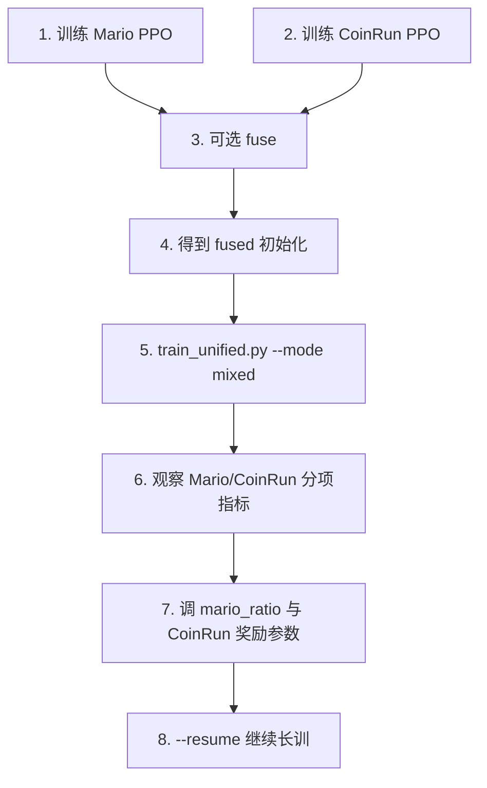

# 通用智能体当前训练路线

> 目标：训练一个可同时玩 Mario 1-1 和 CoinRun 的通用智能体，并让文档与当前真实实验主线保持一致。

---

## 当前结论

当前项目的**推荐主线**已经不再是“先大规模模仿学习，再把专家数据混合成统一策略”，而是：

1. 先分别训练 `mario` 与 `coinrun` 单任务 PPO
2. 可选：用 `tools/fuse_ppo_models.py` 融合两个 PPO，构造更好的统一初始化
3. 用 `train_model/train_unified.py --mode mixed` 做联合训练
4. 长时间训练主要依赖 `--resume` 续训
5. 核心调参对象是 `mario_ratio`、CoinRun 奖励塑形参数、多环境评估指标与训练稳定性

模仿学习仍然保留，但现在更适合作为**可选 warm start**，不是默认入口。

---

## 一、当前推荐主线

### 1.1 主线概览

```text
Mario 单任务 PPO
        \
         +--> 可选：fuse_ppo_models.py --> fused PPO 初始化
        /
CoinRun 单任务 PPO
                 \
                  +--> train_unified.py --mode mixed --> unified 联合训练
                                                     \
                                                      +--> --resume 长时间续训
```

### 1.2 为什么现在改成这条线

- 单任务 PPO 的收敛情况更直接，容易先拿到可靠基线
- `fuse` 可以在不重训两套单任务模型的前提下，快速尝试共享策略初始化
- `train_unified.py` 已经支持 `mixed`、`resume`、分任务评估回调、CoinRun 奖励塑形，工程上更适合持续迭代
- 你当前真正花时间调的是 unified 训练稳定性，而不是 imitation 分类精度

### 1.3 当前最常用命令模板

```bash
python train_model/train_unified.py \
  --mode mixed \
  --resume best_model/unified_from_fused_v1/final_model.zip \
  --exp-id unified_from_fused_v2 \
  --n-envs 10 \
  --mario-ratio 0.6 \
  --total-timesteps 10000000 \
  --fixed-level --start-level 0 --distribution-mode easy \
  --coinrun-progress-coef 0.05 \
  --coinrun-success-bonus 10.0 \
  --coinrun-fail-penalty 2.0 \
  --coinrun-step-penalty 0.002
```

### 1.4 当前主线的关键文件

| 作用 | 文件 |
|------|------|
| 单任务 PPO 统一入口 | `train_model/train_ppo_model.py` |
| Mario 专用入口 | `train_model/train_ppo_mario.py` |
| CoinRun 专用入口 | `train_model/train_ppo_coinrun.py` |
| 通用 mixed/alternating 联合训练 | `train_model/train_unified.py` |
| PPO 权重融合 | `tools/fuse_ppo_models.py` |
| RL 专家轨迹采集 | `playing/record_rl_expert.py` |

---

## 二、当前实验主线的 4 个阶段

### 阶段 A：单任务 PPO 基线

目标：
- 先分别把 Mario 与 CoinRun 训练到“能稳定玩”的水平
- 得到后续 unified 初始化所需的两个基础模型

典型产物：
- `best_model/mario/<exp-id>/ppo_mario_final.zip`
- `best_model/coinrun/<exp-id>/ppo_coinrun_final.zip`

推荐关注：
- 单任务回报是否持续上升
- 同一环境下是否能稳定复现
- CoinRun 是否使用固定关卡 `easy`

### 阶段 B：可选模型融合（fuse）

目标：
- 用两个单任务 PPO 直接做 policy 参数融合
- 在不重新从头训练 unified 的前提下，先构造一个更好的共享初始化

典型工具：
- `tools/fuse_ppo_models.py`

输入：
- `--model-a <mario_model.zip>`
- `--model-b <coinrun_model.zip>`

输出：
- `best_model/fused/.../best_model.zip` 或自定义输出文件

评估逻辑：
- 会分别在 Mario / CoinRun 上评估
- 通过 `alpha` 网格与加权分数选最佳融合权重

### 阶段 C：unified mixed 联合训练

目标：
- 在统一策略中同时兼顾 Mario 与 CoinRun
- 通过 `mario_ratio` 与 CoinRun 奖励塑形平衡两任务

核心参数：
- `--mode mixed`
- `--mario-ratio`
- `--coinrun-reward-scale`
- `--coinrun-progress-coef`
- `--coinrun-success-bonus`
- `--coinrun-fail-penalty`
- `--coinrun-step-penalty`
- `--normalize-reward` / `--no-normalize-reward`

说明：
- `mixed` 是当前主线
- `alternating` 保留为对照方案，不是默认入口

### 阶段 D：resume 长时续训

目标：
- 在已有 unified checkpoint 基础上继续跑长训练
- 避免每次中断后都从头开始

当前推荐做法：
- 使用 `train_model/train_unified.py --resume <checkpoint.zip>`
- 保持训练口径一致：环境类型、并行数、关卡设置、奖励参数尽量不要随意改动

---

## 三、模仿学习现在放在什么位置

### 3.1 当前定位

模仿学习并没有废弃，但它的定位已经变成：

- 可选的 `backbone warm start`
- 用于补论文中的“从离线到在线”的对照实验
- 用于验证 `CustomCNN` 与统一 15 动作空间的数据链路

### 3.2 什么时候值得用 imitation

- 你想测试 `--pretrain-path` 是否能提升单任务 PPO 早期收敛
- 你需要做“有/无 imitation 初始化”的消融实验
- 你需要补充毕业设计中的方法完整性

### 3.3 什么时候不该把 imitation 放主线

- 你现在已经有单任务 PPO、fuse、unified resume 这条更贴近最终目标的路线
- 当前最主要瓶颈已经不是“动作先验不足”，而是双任务平衡与续训稳定性

---

## 四、当前最重要的调参项

### 4.1 环境混合比例

- `--mario-ratio`
- 含义：mixed 模式下 Mario 环境占比，其余为 CoinRun
- 现象判断：
  - Mario 上升、CoinRun 明显掉队：比例可能过高
  - CoinRun 提升但 Mario 退化：比例可能过低，或 CoinRun 奖励过强

### 4.2 CoinRun 奖励塑形

- `--coinrun-reward-scale`
- `--coinrun-progress-coef`
- `--coinrun-success-bonus`
- `--coinrun-fail-penalty`
- `--coinrun-step-penalty`

当前作用：
- 让 CoinRun 的训练信号量级更接近 Mario
- 避免 mixed 训练中某一边奖励主导优化方向

### 4.3 训练稳定性

- `--resume`
- `--normalize-reward`
- `--n-envs`
- 固定关卡参数：`--fixed-level --start-level 0 --distribution-mode easy`

---

## 五、毕业设计建议写法

### 5.1 建议把实验分成两条路线

| 路线 | 用途 |
|------|------|
| 路线 A：imitation -> PPO | 方法完整性、warm start 对照 |
| 路线 B：single PPO -> fuse -> unified resume | 当前主实验主线 |

### 5.2 当前建议作为主结果的实验组

| 实验组 | 描述 |
|--------|------|
| A1 | Mario 单任务 PPO |
| A2 | CoinRun 单任务 PPO |
| B1 | fused PPO 初始化，不做 unified 续训 |
| B2 | fused PPO + unified mixed 训练 |
| B3 | unified mixed + resume 长训 |
| C | imitation warm start vs 非 warm start |

---

## 六、执行顺序（当前推荐）



---

## 七、当前口径下的产物

| 类别 | 典型路径 |
|------|----------|
| Mario 单任务模型 | `best_model/mario/<exp-id>/ppo_mario_final.zip` |
| CoinRun 单任务模型 | `best_model/coinrun/<exp-id>/ppo_coinrun_final.zip` |
| fused 模型 | `best_model/fused*/<name>.zip` |
| unified 最终模型 | `best_model/<exp-id>/final_model.zip` |
| unified 归一化统计 | `best_model/<exp-id>/vecnormalize.pkl` |
| unified TensorBoard | `logs/<exp-id>/` |
| unified 子任务评估 | `callback_logs/<exp-id>/mario/`、`callback_logs/<exp-id>/coinrun/` |

---

*本文档反映 MarioRL 项目当前真实训练方向：以 PPO 基线、模型融合、mixed 联合训练与 resume 长训为核心。*
